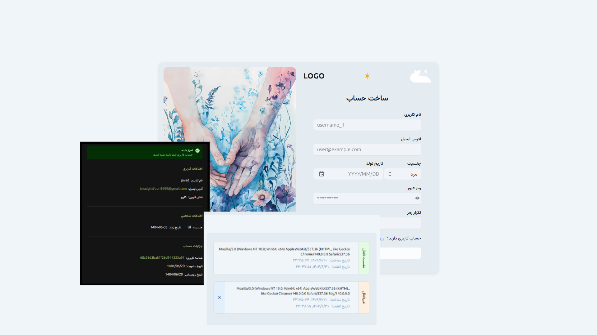

# MERN Authentication System

A full-featured authentication system built with the MERN stack (MongoDB, Express.js, React, Node.js) that provides secure user registration, login, session management, and password recovery functionality.



## Table of Contents

-   [Project Overview](#project-overview)
-   [Features](#features)
-   [Tech Stack](#tech-stack)
-   [Prerequisites](#prerequisites)
-   [Installation](#installation)
-   [Environment Variables](#environment-variables)
-   [Usage](#usage)
-   [API Endpoints](#api-endpoints)
-   [Project Structure](#project-structure)
-   [Deployment](#deployment)
-   [Contributing](#contributing)
-   [License](#license)
-   [Support](#support)

## Project Overview

This is a complete authentication solution built with modern web technologies. It provides a secure, scalable foundation for user authentication in web applications with features like email verification, password reset, session management, and two-factor authentication (2FA).

The application follows best practices for security including password hashing, JWT tokens, secure cookies, and protection against common web vulnerabilities.

## Features

-   🔐 User Registration with Email Verification
-   🔑 Secure Login/Logout System
-   🛡️ Two-Factor Authentication (2FA) Support(Not implemented the Frontend)
-   🔁 Refresh Token Implementation
-   📧 Password Reset via Email
-   👤 User Profile Management
-   🖥️ Session Management (View and Revoke Sessions)
-   🌗 Dark/Light Theme Support
-   📱 Responsive UI with Material Design
-   ⚡ Fast Development with Hot Reload
-   🌍 Internationalization Ready(Simple trnaslations on the spot)

## Tech Stack

### Frontend

-   **React 18+** - UI Library
-   **TypeScript** - Type Safety
-   **Vite** - Build Tool
-   **React Router v7** - Routing
-   **Material UI (MUI)** - UI Components
-   **React Query (TanStack Query)** - Server State Management
-   **React Hook Form** - Form Handling

### Backend

-   **Node.js** - JavaScript Runtime
-   **Express.js** - Web Framework
-   **MongoDB** - Database
-   **Mongoose** - ODM
-   **TypeScript** - Type Safety
-   **JWT** - Token-based Authentication
-   **Bcrypt** - Password Hashing
-   **Resend** - Email Delivery
-   **Zod** - Validation

## Prerequisites

Before you begin, ensure you have the following installed:

-   Node.js (v18 or higher)
-   MongoDB (local or cloud instance)
-   pnpm (package manager)

## Installation

1. Clone the repository:

```bash
git clone https://github.com/Javad-code-stack/mern-auth-1.git
cd mern-auth-1
```

2. Install dependencies for both client and server:

```bash
pnpm install
```

3. Set up environment variables (see [Environment Variables](#environment-variables))

4. Build the project:

```bash
pnpm run build
```

## Environment Variables

### Server Environment Variables (.env in server directory)

```env
APP_ORIGIN=http://localhost:5173
NODE_ENV=development
PORT=5001
MONGO_URI=your_mongodb_connection_string
JWT_ACCESS_SECRET=your_access_token_secret
JWT_REFRESH_SECRET=your_refresh_token_secret
RESEND_API_KEY=your_resend_api_key
EMAIL_SENDER=your_email@example.com
```

### Client Environment Variables (.env in client directory)

The client uses Vite, so variables must be prefixed with `VITE_`:

```env
VITE_API_BASE_URL=http://localhost:5001
```

## Usage

### Development Mode

Start both client and server in development mode:

```bash
# Terminal 1 - Start the server
cd server
pnpm run dev

# Terminal 2 - Start the client
cd client
pnpm run dev
```

Or use the root script to run both concurrently:

```bash
pnpm run dev
```

### Production Mode

1. Build the project:

```bash
pnpm run build
```

2. Start the production server:

```bash
pnpm run start
```

The application will be available at `http://localhost:5001` (or your configured PORT).

## API Endpoints

### Authentication Routes (/auth)

-   `POST /auth/register` - User registration
-   `POST /auth/login` - User login
-   `GET /auth/logout` - User logout
-   `POST /auth/2fa/setup` - Setup two-factor authentication
-   `POST /auth/2fa/verify` - Verify two-factor authentication code
-   `GET /auth/2fa/reset` - Reset two-factor authentication
-   `GET /auth/refresh` - Refresh access token
-   `GET /auth/email/verify/:code` - Verify email with code
-   `POST /auth/password/forgot` - Send password reset email
-   `POST /auth/password/reset` - Reset password with token

### User Routes (/user)

-   `GET /user` - Get current user profile (protected)

### Session Routes (/session)

-   `GET /session` - Get all active sessions (protected)
-   `DELETE /session/:id` - Delete a specific session (protected)

## Project Structure

```
mern-auth/
├── client/                 # React frontend
│   ├── src/
│   │   ├── api/            # API clients
│   │   ├── components/     # Reusable UI components
│   │   ├── hooks/          # Custom React hooks
│   │   ├── lib/            # Utility functions
│   │   ├── pages/          # Page components
│   │   ├── routes/         # Route configuration
│   │   └── utils/          # Helper functions
│   └── ...
├── server/                 # Node.js backend
│   ├── src/
│   │   ├── config/         # Database configuration
│   │   ├── constants/      # Application constants
│   │   ├── controllers/    # Request handlers
│   │   ├── middleware/     # Express middleware
│   │   ├── models/         # Database models
│   │   ├── routes/         # API routes
│   │   ├── services/       # Business logic
│   │   ├── types/          # TypeScript types
│   │   └── utils/          # Utility functions
│   └── ...
└── ...
```

## Deployment

### Render Deployment

1. Create a new Web Service on Render
2. Connect your GitHub repository
3. Set the build command:
    ```
    npm run build
    ```
4. Set the start command:
    ```
    npm run start
    ```
5. Add environment variables in the Render dashboard
6. Deploy!

### Environment Considerations

For production deployment:

-   Set `NODE_ENV=production`
-   Use a production MongoDB instance
-   Configure proper `APP_ORIGIN` for your domain
-   Use strong JWT secrets
-   Configure proper email service

## Contributing

Contributions are welcome! Please follow these steps:

1. Fork the repository
2. Create a feature branch (`git checkout -b feature/AmazingFeature`)
3. Commit your changes (`git commit -m 'Add some AmazingFeature'`)
4. Push to the branch (`git push origin feature/AmazingFeature`)
5. Open a Pull Request

Please ensure your code follows the existing style and includes appropriate tests.

## License

This project is licensed under the ISC License - see the [LICENSE](LICENSE) file for details.

## Support

For support, bug reports, or feature requests, please [open an issue](https://github.com/Javad-code-stack/mern-auth-1/issues) on GitHub.

You can also contact the maintainer directly through the repository.
